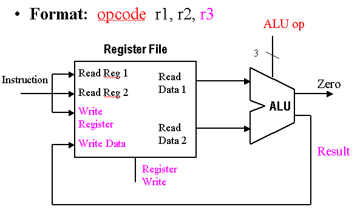
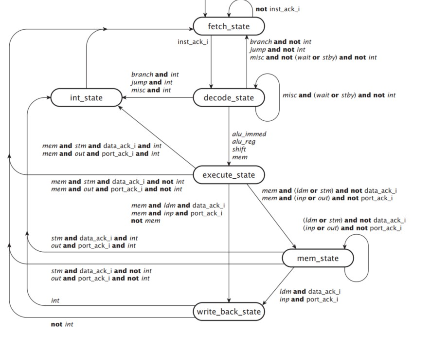

# Gumnut-Core-Processor
The Gumnut is an 8-bit processor core intended for educational purposes. (A gumnut is
a small seedpod of an Australian eucalyptus tree. It is something small from which large
things grow.) The Gumnut is similar to 8-bit microcontrollers for small embedded applications, but has an instruction set architecture more similar to RISC processors. We use it
as the subject of this case study to show how we might develop high-level models of complex devices such as a CPU. We start by describing the view of the processor as seen by
the machine language programmer and by the hardware designer interfacing the processor with the rest of a computer system.

## Processing unit or data path
The *datapath or processing unit* is the hardware that performs all the required operations, for example, ALU, registers, and internal buses. 

Implementation of the datapath for R-format instructions is fairly straightforward - the register file and the ALU are all that is required. The ALU accepts its input from the DataRead ports of the register file, and the register file is written to by the ALUresult output of the ALU, in combination with the RegWrite signal. 

Our datapath has three main blocks:
### ALU
Stands for "Arithmetic Logic Unit." An ALU is an integrated circuit within a CPU or GPU that performs arithmetic and logic operations. Arithmetic instructions include addition, subtraction, and shifting operations, while logic instructions include boolean comparisons, such as AND, OR, XOR, and NOT operations. Our ALU supports the next operations:
| ALU opcode    | Function      |
| ------------- |:-------------:|
| 0000          | Add           |
| 0001          | Substract     |
| 0010          | Add one       |
| 0011          | Add zero      |
| 0100          | AND           |  
| 0101          | OR            |
| 0110          | XOR           |
| 0111          | NOT           |
| 1000          | Shift         |
| 1001          | Shift         |
| 1010          | Shift         |
| 1011          | Shift         |
| 1100          | Shift         |
| 1100          | Shift         |
| 1111          | Shift         |
| 1110          | Shift         |

Our ALU has three main block:
* **ALUA**: Stands for "Arithmetic Logic Unit Arithmetic." This performs the arithmetic operations of our CPU.
* **ALUL**: Stands for "Arithmetic Logic Unit Logic." This performs the logic operations of our CPU.
* **ALUS**: Stands for "Arithmetic Logic Unit Shifter." This performs the shift operations of our CPU. Shifting is moving a bit pattern to the left or right.
>Inside the img directory are the RTL diagrams from the ALU.

### Register bank
A register file is an array of processor registers in a central processing unit (CPU). 

Our implementations has eight registers of eight bits which can read two values and write one simultaneously.
### Instruction Register
The instructions register routes the instruction bits according to our [instruction set](img/instruction_set.xlsx). 

## Control Unit
A control unit (CU) is an integrated circuit in a processor that controls the input and output. It receives instructions from a program, then passes them to the arithmetic logic unit (ALU). The ALU performs the appropriate calculations and sends the resulting values back to the control unit. The control unit sends these values to the corresponding program as output.

Our CPU has six states:

## PC Unit
Our PC Unit has three main components:
### Program counter and new program counter
The program counter loads individual instructions from memory and stores them sequentially. The instruction register decodes these instructions and converts them to commands for the CPU. After each instruction, the CU increments the program counter and fetches the next instruction.

### Interruption register
After an interruption happens the interruption register store the current program counter and the current flags.

>Inside the img directory is the RTL diagram from the PC Unit.

## Resources
https://techterms.com/definition/alu

https://www.cise.ufl.edu/~mssz/CompOrg/CDA-proc.html

https://techterms.com/definition/control_unit

Ashenden, P. J. (2010). The designer's guide to VHDL. Morgan Kaufmann.
