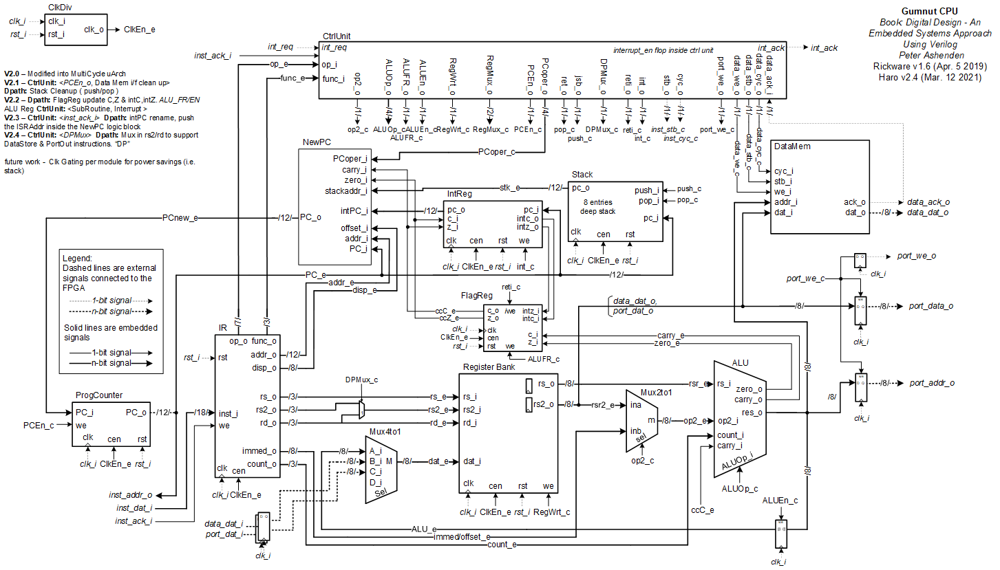

# Gumnut-Core-Processor

## Processing unit
### ALU
Stands for "Arithmetic Logic Unit." An ALU is an integrated circuit within a CPU or GPU that performs arithmetic and logic operations. Arithmetic instructions include addition, subtraction, and shifting operations, while logic instructions include boolean comparisons, such as AND, OR, XOR, and NOT operations. Our ALU supports the next operations:
| ALU opcode    | Function      |
| ------------- |:-------------:|
| 0000          | Add           |
| 0001          | Substract     |
| 0010          | Add one       |
| 0011          | Add zero      |
| 0100          | AND           |  
| 0101          | OR            |
| 0110          | XOR           |
| 0111          | NOT           |
| 1000          | Shift         |
| 1001          | Shift         |
| 1010          | Shift         |
| 1011          | Shift         |
| 1100          | Shift         |
| 1100          | Shift         |
| 1111          | Shift         |
| 1110          | Shift         |

Our ALU has three main block:
* **ALUA**: Stands for "Arithmetic Logic Unit Arithmetic." This performs the arithmetic operations of our CPU.
* **ALUL**: Stands for "Arithmetic Logic Unit Logic." This performs the logic operations of our CPU.
* **ALUS**: Stands for "Arithmetic Logic Unit Shifter." This performs the shift operations of our CPU. Shifting is moving a bit pattern to the left or right.
>Inside the img directory are the RTL diagrams from the ALU.

## Resources
https://techterms.com/definition/alu